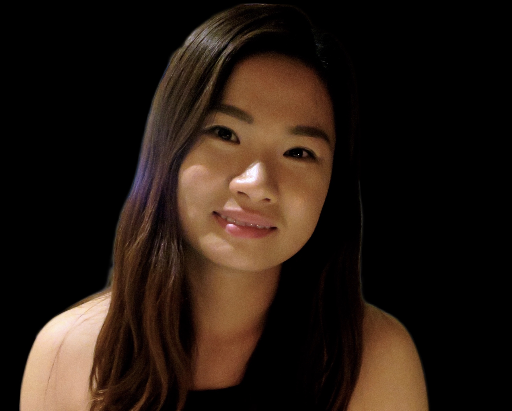

# Welcome
<figure class="image" style="float:right; width:30%; margin-left:10pt">

<figcaption style="text-align:center;"><a href="mailto:thaophung502@gmail.com" style="color:black;">thaophung502[at]gmail[dot]com</a></figcaption>
</figure>
<!--I'm a Ph.D. student in computer science at Auburn University, advised by [Wei-Shinn Ku][ku]. My research interests focus on data management and machine learning. 

Before coming to Auburn,I obtained my B.S. in Computer Science from University of Wyoming. -->

<!--I am currently looking for full-time positions in software engineering, data science, or related fields. I have professional experience with machine learning applications and cutting-edge research.-->

<!--During my undergraduate, I worked as a research assistant at [Evolving AI Lab][lab]. I worked with [Anh Nguyen][anh] in [learning to solve symbolic math from visual inputs][project], in which we studied if deep neural networks (DNNs) can learn to extract the meanings behind visual symbols.-->

Hello! I am Thao Phung, a PhD student in Computer Science at Colorado School of Mines. I am advised by [Dr. Tom Williams][tom] at the Mines Interactive Robotics Research Lab ([MIRRORLab][mirrorlab]). My current research interests include human-robot interaction, augmented reality. 

## Education
- M.S., Ph.D. in Computer Science, Colorado School of Mines, Current
- B.S. in Computer Science, University of Wyoming, 2018

## Research Areas
- Human-Robot Interaction
- Augmented Reality
- Cognitive Science
- Machine Learning

## Publications
- [** What's The Point? Tradeoffs Between Effectiveness and Social Perception When Using mixed Reality to Enhance Gesturally Limited Robots**][phung2021hri]
  **Authors**: Jared Hamilton*, **Thao Phung***, Nhan Tran, Tom Williams | **Venue**: HRI 2021

- [**Exploring Mixed Reality Robot Communication Under Different Types of Mental Workload**][mentalWorkload]  
   **Authors**: Nhan Tran, Kai Mizuno, Trevor Grant, **Thao Phung**, Leanne Hirshfield, Tom Williams | **Venue**: VAM-HRI 2020

- [**Investigating Confidence-Based Category Transition of Spatial Gestures**][adamWorkshop]  
   **Authors**: Adam Stogsdill, **Thao Phung**, Tom Williams | **Venue**: HRI-NLG 2020

<!--Contact: thaophung502[at]gmail[dot]com-->

---
[lab]: http://www.evolvingai.org/
[anh]: http://anhnguyen.me/research/
[project]: https://www.thaophung.com/projects/
[ku]: http://auburn.edu/academic/engineering/dslab/
[tom]: https://people.mines.edu/twilliams/
[mirrorlab]: https://mirrorlab.mines.edu/

<!--PAPERS-->
[mentalWorkload]: https://mirrorlab.mines.edu/publications/tran2020vamhri/
[adamWorkshop]: https://mirrorlab.mines.edu/publications/stogsdill2020hrinlg/
